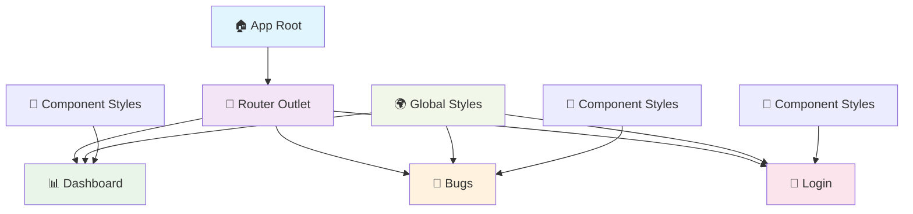
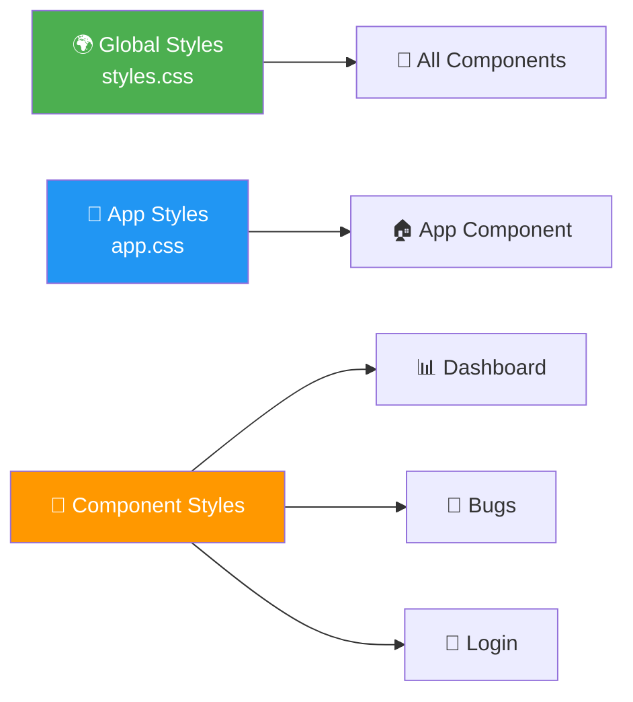

# 🚀 Sample App - Angular Training Project

<div align="center">


</div>

## 📋 Project Overview

A modern Angular application demonstrating **standalone components**, **routing**, and **global styling**. Built as part of Angular Training Phase 1, Day 1.

### ✨ Features

- 🎯 **Standalone Components** - Modern Angular architecture
- 🧭 **Client-side Routing** - Navigate between pages seamlessly
- 🎨 **Global & Component Styling** - Beautiful UI with CSS styling
- 📱 **Responsive Design** - Works on all devices
- 🔧 **TypeScript Support** - Type-safe development

## 🏗️ Project Structure

```
📦 Sample-app/
├── 📁 src/
│   ├── 📁 app/
│   │   ├── 📁 pages/
│   │   │   ├── 📁 dashboard/          # 📊 Dashboard Component
│   │   │   │   ├── dashboard.ts
│   │   │   │   ├── dashboard.html
│   │   │   │   └── dashboard.css
│   │   │   ├── 📁 bugs/               # 🐛 Bugs Component
│   │   │   │   ├── bugs.ts
│   │   │   │   ├── bugs.html
│   │   │   │   └── bugs.css
│   │   │   └── 📁 login/              # 🔐 Login Component
│   │   │       ├── login.ts
│   │   │       ├── login.html
│   │   │       └── login.css
│   │   ├── app.ts                     # 🏠 Main App Component
│   │   ├── app.html                   # 📄 App Template
│   │   ├── app.css                    # 🎨 App Styles
│   │   ├── app.routes.ts              # 🛣️ Routing Configuration
│   │   └── app.config.ts              # ⚙️ App Configuration
│   ├── main.ts                        # 🚀 Bootstrap Entry Point
│   ├── styles.css                     # 🌍 Global Styles
│   └── index.html                     # 📋 HTML Entry Point
├── angular.json                       # 🔧 Angular CLI Config
├── package.json                       # 📦 Dependencies
└── tsconfig.json                      # 📝 TypeScript Config
```

## 🗺️ Application Flow



## 🛣️ Routing Configuration

| Route | Component | Description |
|-------|-----------|-------------|
| `/` | 🔄 Redirect | → Dashboard |
| `/dashboard` | 📊 Dashboard | Main dashboard page |
| `/bugs` | 🐛 Bugs | Bug tracking page |
| `/login` | 🔐 Login | User authentication |
| `/**` | 🔄 Wildcard | → Dashboard |

## 🎨 Styling Architecture



## 🚀 Getting Started

### Prerequisites
- 📦 Node.js (v18+)
- 🅰️ Angular CLI (v20+)
- 💻 VS Code (recommended)

### Installation

```bash
# 📥 Clone the repository
git clone <repository-url>

# 📂 Navigate to project
cd Sample-app

# 📦 Install dependencies
npm install
```

### 🏃‍♂️ Development Server

```bash
# 🚀 Start development server
npm start
# or
ng serve
```

🌐 Open [http://localhost:4200](http://localhost:4200) in your browser

### 🏗️ Build for Production

```bash
# 📦 Build the project
npm run build
# or
ng build
```

## 🧪 Testing

```bash
# 🧪 Run unit tests
npm test

# 🔍 Run e2e tests
npm run e2e
```

## 🛠️ Key Technologies

<div align="center">

| Technology | Version | Purpose |
|------------|---------|----------|
| 🅰️ **Angular** | 20.1.6 | Frontend Framework |
| 📘 **TypeScript** | 5.0+ | Type Safety |
| 🎨 **CSS3** | Latest | Styling |
| 🧭 **Angular Router** | 20.1.6 | Navigation |
| 🔧 **Angular CLI** | 20.1.6 | Development Tools |

</div>

## 📚 Learning Objectives

- ✅ **Standalone Components** - Modern Angular architecture
- ✅ **Routing & Navigation** - Single Page Application
- ✅ **Component Communication** - Data flow patterns
- ✅ **Styling Strategies** - Global vs Component styles
- ✅ **TypeScript Integration** - Type-safe development

## 🤝 Contributing

1. 🍴 Fork the repository
2. 🌿 Create feature branch (`git checkout -b feature/amazing-feature`)
3. 💾 Commit changes (`git commit -m 'Add amazing feature'`)
4. 📤 Push to branch (`git push origin feature/amazing-feature`)
5. 🔄 Open Pull Request

## Author
- **Soundar Raja B**

## 📄 License

This project is part of Angular Training materials.

---

