# 🐛 Bug Tracker - Full Stack Angular Training Project

<div align="center">


</div>

## 📋 Project Overview

A **modern full-stack bug tracking application** built with Angular 20+ frontend and Spring Boot 3.5+ backend, featuring JWT authentication, role-based access control, comprehensive analytics dashboard, and real-time data visualization.

### ✨ Core Features

- 🎯 **Analytics Dashboard** - Real-time statistics with Chart.js visualization
- 📊 **Interactive Charts** - Pie, doughnut, and bar charts showing bug metrics
- 🐛 **Complete Bug Management** - Full CRUD operations with advanced filtering
- 🔍 **Advanced Search & Filter** - Search by text, status, priority with pagination
- 🔐 **JWT Authentication** - Secure token-based authentication system
- 🛡️ **Role-Based Security** - ADMIN, DEVELOPER, USER role permissions
- 🚫 **Route Protection** - AuthGuard and RoleGuard implementation
- 🌐 **RESTful API** - Spring Boot backend with comprehensive endpoints
- 🎨 **Modern UI** - PrimeNG components with responsive design
- ⚡ **Optimistic Updates** - Immediate UI feedback with error handling

## 🏗️ Application Architecture

```mermaid
graph TB
    subgraph "Frontend (Angular 20+)"
        A[📊 Dashboard] --> B[Chart.js Visualization]
        A --> C[Bug Statistics]
        D[🐛 Bug Management] --> E[Bug List with Pagination]
        E --> F[Search & Filters]
        E --> G[Bug Detail Modal]
        H[🔐 Authentication] --> I[JWT Guards]
        J[🌐 HTTP Services] --> K[JWT Interceptor]
    end
    
    subgraph "Backend (Spring Boot 3.5)"
        L[🔐 Auth Controller] --> M[JWT Service]
        N[🐛 Bug Controller] --> O[Bug Service]
        O --> P[JPA Repository]
        P --> Q[PostgreSQL Database]
        R[🛡️ Security Config] --> L
        R --> N
    end
    
    J -->|REST API| N
    J -->|Auth API| L
    
    style A fill:#1e40af,color:#fff
    style D fill:#1e40af,color:#fff
    style H fill:#dc2626,color:#fff
    style L fill:#6DB33F,color:#fff
    style N fill:#6DB33F,color:#fff
```



## 📊 Dashboard Features

### **Analytics Dashboard**
- **Real-time Statistics**: Total, open, closed, and high-priority bug counts
- **Interactive Charts**: 
  - 🥧 **Pie Chart**: Status distribution (Open, In Progress, Closed)
  - 🍩 **Doughnut Chart**: Priority breakdown (High, Medium, Low)
  - 📊 **Bar Chart**: Priority vs Status correlation analysis
- **Dynamic Updates**: Charts automatically refresh with data changes
- **User Context**: Personalized welcome with username display

### **Chart Configuration**
- **Chart.js Integration**: Professional data visualization
- **Responsive Design**: Charts adapt to screen size
- **Color Coding**: Consistent color scheme across all charts
- **Interactive Legends**: Click to toggle data series

## 🐛 Bug Management System

### **Advanced Bug List**
- **Paginated Grid**: Efficient loading with customizable page sizes (6, 12, 24, 48)
- **Real-time Search**: Debounced search with 300ms delay
- **Multi-Filter Support**: Filter by status, priority, assignee, project
- **Sorting Options**: Sort by ID, title, status, priority, assignee, project
- **Quick Stats**: Live statistics cards with filter integration

### **Bug Operations**
- **Status Updates**: Direct status changes via dropdown (DEVELOPER role)
- **Optimistic Updates**: Immediate UI feedback with error rollback
- **Form Validation**: Comprehensive client-side validation
- **Confirmation Dialogs**: Safe delete operations with confirmation

### **CRUD Operations by Role**
- ✅ **Create/Update/Delete**: Full access (ADMIN role)
- ✅ **Status Updates**: Change bug status (DEVELOPER role)
- ✅ **Read Access**: View bugs and statistics (USER role)
- ✅ **Advanced Search**: All roles can search and filter

## 🎨 Design System

### **UI Framework**
- **PrimeNG**: Professional Angular UI components
- **PrimeFlex**: Utility-first CSS framework
- **PrimeIcons**: Comprehensive icon library
- **Lara Theme**: Modern design system

### **Color Palette**
- **Status Colors**: Red (Open), Orange (In Progress), Green (Closed)
- **Priority Colors**: Red (High), Orange (Medium), Green (Low)
- **Chart Colors**: Consistent color mapping across visualizations
- **Interactive States**: Hover and focus states for all components

### **Component Library**
- **Cards**: Bug display with consistent styling
- **Buttons**: Action buttons with role-based visibility
- **Forms**: Reactive forms with validation
- **Modals**: Confirmation dialogs and detail views
- **Toast Messages**: Success/error notifications

## 🚀 Getting Started

### Prerequisites
```bash
📦 Node.js (v18+)
🅰️ Angular CLI (v20+)
☕ Java 21
🔧 Maven 3.6+
🐘 PostgreSQL 12+
```

### Installation
```bash
# Clone repository
git clone <repository-url>
cd "Day10&11"

# Backend setup
cd backend
./mvnw spring-boot:run
# Runs on http://localhost:8080

# Frontend setup
cd ../frontend
npm install
ng serve
# Runs on http://localhost:4200
```

### Database Configuration
```properties
# PostgreSQL Configuration (application.properties)
spring.datasource.url=jdbc:postgresql://localhost:5432/bug_tracker
spring.datasource.username=postgres
spring.datasource.password=jdbc

# JPA Configuration
spring.jpa.hibernate.ddl-auto=update
spring.jpa.show-sql=true
```

### Default Users
```bash
# Admin User (Full Access)
Username: admin
Password: admin123
Role: ADMIN

# Developer User (Bug Management)
Username: dev
Password: dev123
Role: DEVELOPER

# Regular User (Read Only)
Username: SR
Password: 143
Role: USER
```

## 📁 Project Structure

```
📦 Day10&11/
├── 📁 frontend/                    # Angular 20+ Frontend
│   ├── 📁 src/app/
│   │   ├── 📁 pages/
│   │   │   ├── 📁 dashboard/       # 📊 Analytics Dashboard
│   │   │   │   ├── dashboard.ts    # Chart.js integration
│   │   │   │   ├── dashboard.html  # Dashboard layout
│   │   │   │   └── dashboard.css   # Dashboard styling
│   │   │   ├── 📁 bugs/            # 🐛 Bug Management
│   │   │   │   ├── 📁 bug-item/    # Bug card component
│   │   │   │   ├── 📁 bug-detail/  # Bug detail modal
│   │   │   │   ├── bugs.ts         # Main bugs component
│   │   │   │   └── bugs.html       # Bug list layout
│   │   │   ├── 📁 login/           # 🔐 Authentication
│   │   │   └── 📁 unauthorized/    # Access denied page
│   │   ├── 📁 services/            # HTTP Services
│   │   │   ├── auth.service.ts     # Authentication service
│   │   │   └── bug.service.ts      # Bug API service
│   │   ├── 📁 guards/              # Route Protection
│   │   │   ├── auth.guard.ts       # Authentication guard
│   │   │   └── role.guard.ts       # Role-based guard
│   │   └── 📁 interceptors/        # HTTP Interceptors
│   │       └── jwt.interceptor.ts  # JWT token handling
│   └── package.json                # Dependencies
├── 📁 backend/                     # Spring Boot 3.5 Backend
│   ├── 📁 src/main/java/com/ex/bug_tracker_security_basic_auth/
│   │   ├── 📁 controller/          # REST Controllers
│   │   │   ├── AuthController.java # Authentication endpoints
│   │   │   └── BugController.java  # Bug CRUD endpoints
│   │   ├── 📁 service/             # Business Logic
│   │   │   ├── BugService.java     # Bug operations
│   │   │   ├── JwtService.java     # JWT token service
│   │   │   └── JwtAuthFilter.java  # JWT filter
│   │   ├── 📁 entity/              # JPA Entities
│   │   │   ├── Bug.java            # Bug entity
│   │   │   ├── Status.java         # Status enum
│   │   │   └── Priority.java       # Priority enum
│   │   ├── 📁 dto/                 # Data Transfer Objects
│   │   ├── 📁 config/              # Configuration
│   │   │   ├── SecurityConfig.java # Security configuration
│   │   │   └── DataInitializer.java# Sample data
│   │   └── 📁 repository/          # JPA Repositories
│   └── pom.xml                     # Maven dependencies
└── README.md                       # This file
```

## 🔧 Technical Implementation

### **Frontend Technologies**
- **Angular 20.2.3**: Latest framework with standalone components
- **Chart.js 4.5.0 + ng2-charts**: Advanced data visualization
- **PrimeNG 20.1.1**: Professional UI component library
- **TypeScript 5.8.2**: Type-safe development
- **RxJS**: Reactive programming with observables

### **Backend Technologies**
- **Spring Boot 3.5.4**: Modern REST API framework
- **Spring Security**: JWT-based authentication
- **JPA/Hibernate**: Database ORM with PostgreSQL
- **JWT (jjwt 0.11.5)**: Token generation and validation
- **Lombok**: Reduced boilerplate code

### **Key Features Implemented**
- **JWT Authentication**: Stateless token-based security
- **Role-Based Access Control**: ADMIN, DEVELOPER, USER roles
- **Advanced Pagination**: Server-side pagination with sorting
- **Real-time Search**: Debounced search with filtering
- **Optimistic Updates**: Immediate UI feedback
- **Error Handling**: Comprehensive error management
- **CORS Configuration**: Cross-origin resource sharing

## 📈 Performance & Quality

- **Bundle Size**: Optimized for production
- **Loading Speed**: Fast initial load
- **Responsive**: Works on all devices
- **Accessibility**: WCAG compliant
- **Code Quality**: TypeScript strict mode
- **Security**: JWT + Spring Security

## 🎯 Learning Outcomes

### **Frontend Skills**
- ✅ Angular 20+ with standalone components
- ✅ Chart.js integration for data visualization
- ✅ PrimeNG component library usage
- ✅ JWT authentication and route guards
- ✅ HTTP interceptors and error handling
- ✅ Reactive forms and validation
- ✅ RxJS operators and observables
- ✅ Optimistic updates and UX patterns

### **Backend Skills**
- ✅ Spring Boot 3.5+ REST API development
- ✅ JWT token generation and validation
- ✅ Spring Security with role-based access
- ✅ JPA repositories and custom queries
- ✅ Pagination and sorting implementation
- ✅ CORS configuration and security
- ✅ Exception handling and validation

### **Full-Stack Integration**
- ✅ Secure API communication with JWT
- ✅ Role-based UI component rendering
- ✅ Real-time data synchronization
- ✅ Professional error handling patterns
- ✅ Modern development practices

## 🔗 API Endpoints

### Authentication
```
POST /api/auth/login    # User authentication (returns JWT token)
```

### Bug Management (JWT Protected)
```
# General Access (All authenticated users)
GET    /api/bugs                    # Get paginated bugs with filters
GET    /api/bugs/stats              # Get bug statistics
GET    /api/bugs/id/{id}            # Get bug by ID
GET    /api/bugs/filter             # Filter bugs by criteria
GET    /api/bugs/search             # Advanced search with pagination

# Developer Access (DEVELOPER, ADMIN roles)
PUT    /api/bugs/developer/{id}/status  # Update bug status

# Admin Access (ADMIN role only)
POST   /api/bugs/admin              # Create new bug
PUT    /api/bugs/admin/{id}         # Update bug
DELETE /api/bugs/admin/{id}         # Delete bug
```

### Query Parameters
```
# Pagination & Sorting
page=1&size=12&sort=id,desc

# Filtering
status=OPEN&priority=HIGH&assignee=dev&project=WebApp

# Search
search=login%20bug
```

## 🏆 Project Highlights

- **Modern Stack**: Angular 20+ with Spring Boot 3.5+ and Java 21
- **Professional UI**: PrimeNG components with responsive design
- **Advanced Security**: JWT authentication with role-based authorization
- **Real-time Analytics**: Interactive Chart.js visualizations
- **Optimized Performance**: Pagination, debounced search, optimistic updates
- **Error Resilience**: Comprehensive error handling with user feedback
- **Developer Experience**: TypeScript strict mode, standalone components
- **Production Ready**: CORS configuration, security best practices

---

**Built with ❤️ for Angular Training Phase 1 (Day 10 & 11) - Demonstrating modern full-stack development with security and analytics**