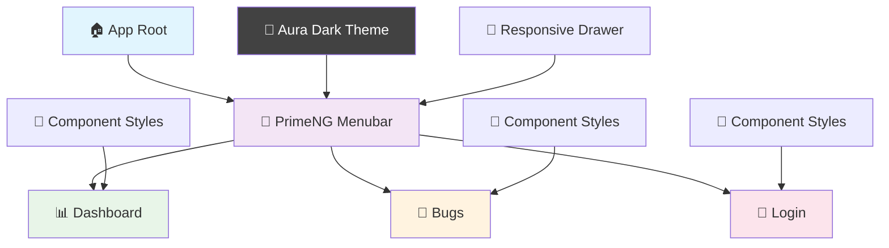

# 🚀 Sample App - Angular Training Project

<div align="center">


</div>

## 📋 Project Overview

A modern Angular application demonstrating **standalone components**, **PrimeNG UI library**, **routing**, and **responsive design**. Built as part of Angular Training Phase 1, Day 2.

### ✨ Features

- 🎯 **Standalone Components** - Modern Angular architecture
- 🧭 **Client-side Routing** - Navigate between pages seamlessly
- 🎨 **PrimeNG Integration** - Professional UI components
- 🌙 **Dark Mode Support** - Aura theme with dark mode
- 📱 **Responsive Design** - Mobile-friendly sidebar navigation
- 🔧 **TypeScript Support** - Type-safe development
- 🎭 **Font Awesome Icons** - Rich icon library

## 🏗️ Project Structure

```
📦 Sample-app/
├── 📁 src/
│   ├── 📁 app/
│   │   ├── 📁 pages/
│   │   │   ├── 📁 dashboard/          # 📊 Dashboard Component
│   │   │   │   ├── dashboard.ts       # Component logic
│   │   │   │   ├── dashboard.html     # Template
│   │   │   │   └── dashboard.css      # Styles
│   │   │   ├── 📁 bugs/               # 🐛 Bugs Component
│   │   │   │   ├── bugs.ts
│   │   │   │   ├── bugs.html
│   │   │   │   └── bugs.css
│   │   │   └── 📁 login/              # 🔐 Login Component
│   │   │       ├── login.ts
│   │   │       ├── login.html
│   │   │       └── login.css
│   │   ├── app.ts                     # 🏠 Main App Component
│   │   ├── app.html                   # 📄 App Template with PrimeNG
│   │   ├── app.css                    # 🎨 App Styles
│   │   ├── app.routes.ts              # 🛣️ Routing Configuration
│   │   └── app.config.ts              # ⚙️ App Configuration with PrimeNG
│   ├── main.ts                        # 🚀 Bootstrap Entry Point
│   ├── styles.css                     # 🌍 Global Styles + PrimeIcons
│   └── index.html                     # 📋 HTML Entry Point + Font Awesome
├── angular.json                       # 🔧 Angular CLI Config
├── package.json                       # 📦 Dependencies
└── tsconfig.json                      # 📝 TypeScript Config
```

## 🎨 UI Components Used

### PrimeNG Components
- **p-menubar** - Top navigation bar
- **p-drawer** - Collapsible sidebar
- **p-card** - Content containers
- **p-button** - Interactive buttons

### Icon Libraries
- **PrimeIcons** - `pi pi-home`, `pi pi-user`
- **Font Awesome** - `fas fa-bug` for bug icon

## 🗺️ Application Flow



## 🛣️ Routing Configuration

| Route | Component | Description | Icon |
|-------|-----------|-------------|------|
| `/` | 🔄 Redirect | → Dashboard | - |
| `/dashboard` | 📊 Dashboard | Main dashboard page | `pi pi-home` |
| `/bugs` | 🐛 Bugs | Bug tracking page | `fas fa-bug` |
| `/login` | 🔐 Login | User authentication | `pi pi-user` |
| `/**` | 🔄 Wildcard | → Dashboard | - |

## 🎨 Styling Architecture

### Theme Configuration
```typescript
// app.config.ts
providePrimeNG({
  theme: {
    preset: Aura,
    options: {
      darkModeSelector: '.dark-mode'
    }
  }
})
```

### CSS Structure
- **Global Styles** (`styles.css`) - PrimeIcons import + base styles
- **Component Styles** (`app.css`) - Sidebar navigation styling
- **PrimeNG Theme** - Aura dark mode preset

## 🚀 Getting Started

### Prerequisites
- 📦 Node.js (v18+)
- 🅰️ Angular CLI (v20+)
- 💻 VS Code (recommended)

### Installation

```bash
# 📥 Clone the repository
git clone <repository-url>

# 📂 Navigate to project
cd Sample-app

# 📦 Install dependencies
npm install
```

### 🏃♂️ Development Server

```bash
# 🚀 Start development server
npm start
# or
ng serve
```

🌐 Open [http://localhost:4200](http://localhost:4200) in your browser

### 🏗️ Build for Production

```bash
# 📦 Build the project
npm run build
# or
ng build
```

## 🛠️ Key Technologies & Dependencies

<div align="center">

| Technology | Version | Purpose |
|------------|---------|----------|
| 🅰️ **Angular** | 20.1.6 | Frontend Framework |
| 📘 **TypeScript** | 5.0+ | Type Safety |
| 🎨 **PrimeNG** | 20.0.1 | UI Component Library |
| 🎭 **PrimeIcons** | Latest | Icon Library |
| 🐛 **Font Awesome** | 6.4.0 | Additional Icons |
| 🧭 **Angular Router** | 20.1.6 | Navigation |
| 🔧 **Angular CLI** | 20.1.6 | Development Tools |

</div>

## 📱 Features Breakdown

### Navigation System
- **Top Menubar** - PrimeNG menubar with app branding
- **Sidebar Drawer** - Collapsible navigation with smooth animations
- **Responsive Design** - Mobile-friendly hamburger menu

### Theme System
- **Dark Mode** - Enabled by default with Aura theme
- **CSS Variables** - Customizable color scheme
- **Component Theming** - Consistent styling across all components

### Routing
- **Lazy Loading Ready** - Structured for future optimization
- **Route Guards** - Prepared for authentication
- **Dynamic Titles** - Page titles update on navigation

## 🎯 Learning Objectives Achieved

- ✅ **Standalone Components** - Modern Angular architecture
- ✅ **PrimeNG Integration** - Professional UI library usage
- ✅ **Routing & Navigation** - Single Page Application
- ✅ **Theme Configuration** - Dark mode implementation
- ✅ **Responsive Design** - Mobile-first approach
- ✅ **TypeScript Integration** - Type-safe development
- ✅ **Icon Libraries** - Multiple icon sources

## 🔧 Configuration Files

### Angular Configuration
- `angular.json` - Build and serve configurations
- `tsconfig.json` - TypeScript compiler options
- `package.json` - Dependencies and scripts

### App Configuration
- `app.config.ts` - Providers and PrimeNG setup
- `app.routes.ts` - Route definitions
- `main.ts` - Application bootstrap

## 🤝 Contributing

1. 🍴 Fork the repository
2. 🌿 Create feature branch (`git checkout -b feature/amazing-feature`)
3. 💾 Commit changes (`git commit -m 'Add amazing feature'`)
4. 📤 Push to branch (`git push origin feature/amazing-feature`)
5. 🔄 Open Pull Request

## 👨‍💻 Author
- **Soundar Raja B** - Angular Training Phase 1

## 📄 License

This project is part of Angular Training materials.

---
