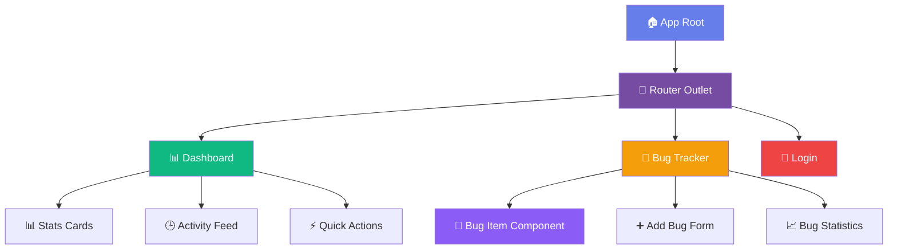
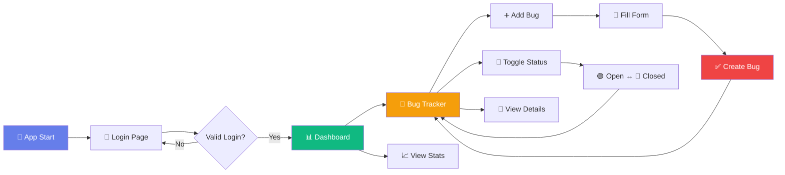

# 🐛 Bug Tracker - Advanced Angular Training Project

<div align="center">


</div>

## 📋 Project Overview

A **professional bug tracking application** built with Angular, featuring advanced UI components, dynamic bug management, and real-time status updates. Perfect for learning modern Angular development patterns.

### ✨ Core Features

- 🎯 **Standalone Components** - Modern Angular architecture
- 🧭 **Client-side Routing** - Seamless navigation between pages
- 🐛 **Dynamic Bug Management** - Add, view, and toggle bug status
- 📊 **Real-time Dashboard** - Live statistics and activity feed
- 🎨 **Advanced UI/UX** - Glassmorphism, gradients, and animations
- 📱 **Responsive Design** - Mobile-first approach
- 🔧 **TypeScript Support** - Type-safe development
- 🎭 **Component Communication** - Parent-child data flow
- 🔄 **Status Management** - Toggle between Open/Closed states

## 🏗️ Application Architecture



## 🎨 UI Component Showcase

### 📊 Dashboard Analytics
```
┌─────────────────────────────────────────────────────────────┐
│  📊 Project Dashboard                                       │
│  Real-time bug tracking and analytics                      │
├─────────────────────────────────────────────────────────────┤
│  🐛 Total: 5    🔴 Open: 3    ✅ Closed: 2    ⚠️ High: 1   │
├─────────────────────────────────────────────────────────────┤
│  🕒 Recent Activity          ⚡ Quick Actions               │
│  • Bug #1 reported          • 🐛 View All Bugs            │
│  • Bug #3 closed            • ➕ Report New Bug           │
│  • Bug #2 updated                                          │
└─────────────────────────────────────────────────────────────┘
```

### 🐛 Bug Management Interface
```
┌─────────────────────────────────────────────────────────────┐
│  🐛 Bug Tracker                    [➕ Add New Bug]        │
├─────────────────────────────────────────────────────────────┤
│  📊 Stats: Total: 5 | Showing: 5                          │
├─────────────────────────────────────────────────────────────┤
│  ┌─────────────────────────────────────────────────────┐   │
│  │ #1 🟢 Open                                    [✓]   │   │
│  │ Login Authentication Failed                         │   │
│  │ Users are unable to authenticate with credentials   │   │
│  │                                            🔴 HIGH  │   │
│  └─────────────────────────────────────────────────────┘   │
│  ┌─────────────────────────────────────────────────────┐   │
│  │ #2 🟢 Open                                    [✓]   │   │
│  │ Submit Button Unresponsive                          │   │
│  │ Form submission button does not respond to clicks   │   │
│  │                                          🟡 MEDIUM  │   │
│  └─────────────────────────────────────────────────────┘   │
└─────────────────────────────────────────────────────────────┘
```

## 🛣️ Application Flow Chart



## 📊 Feature Comparison Chart

| Feature | Status | Complexity | Learning Value |
|---------|--------|------------|----------------|
| 🎯 Standalone Components | ✅ Complete | 🟢 Beginner | ⭐⭐⭐⭐⭐ |
| 🧭 Routing & Navigation | ✅ Complete | 🟢 Beginner | ⭐⭐⭐⭐ |
| 🎨 Advanced CSS Styling | ✅ Complete | 🟡 Intermediate | ⭐⭐⭐⭐⭐ |
| 🐛 Dynamic Bug Management | ✅ Complete | 🟡 Intermediate | ⭐⭐⭐⭐⭐ |
| 📊 Real-time Dashboard | ✅ Complete | 🟡 Intermediate | ⭐⭐⭐⭐ |
| 🎭 Component Communication | ✅ Complete | 🟡 Intermediate | ⭐⭐⭐⭐⭐ |
| 📱 Responsive Design | ✅ Complete | 🟢 Beginner | ⭐⭐⭐ |
| 🔄 State Management | ✅ Complete | 🟡 Intermediate | ⭐⭐⭐⭐ |

## 🎨 Color Palette & Design System

### 🌈 Primary Colors
- **Primary Gradient**: `#667eea → #764ba2` 🔵
- **Success**: `#10b981` 🟢
- **Warning**: `#f59e0b` 🟡
- **Danger**: `#ef4444` 🔴
- **Info**: `#3b82f6` 🔵

### 🎭 UI Components
```css
/* Glassmorphism Effect */
background: rgba(255, 255, 255, 0.95);
backdrop-filter: blur(10px);
border: 1px solid rgba(255,255,255,0.2);

/* Gradient Buttons */
background: linear-gradient(135deg, #667eea 0%, #764ba2 100%);
box-shadow: 0 4px 12px rgba(102, 126, 234, 0.3);

/* Priority Badges */
🔴 High:   linear-gradient(135deg, #ef4444 0%, #dc2626 100%)
🟡 Medium: linear-gradient(135deg, #f59e0b 0%, #d97706 100%)
🟢 Low:    linear-gradient(135deg, #10b981 0%, #059669 100%)
```

## 🚀 Getting Started

### Prerequisites
```bash
📦 Node.js (v18+)
🅰️ Angular CLI (v20+)
💻 VS Code (recommended)
🌐 Modern Browser
```

### Installation & Setup
```bash
# 📥 Clone the repository
git clone <repository-url>
cd Sample-app

# 📦 Install dependencies
npm install

# 🚀 Start development server
npm start
# or
ng serve

# 🌐 Open browser
http://localhost:4200
```

### 🏗️ Build Commands
```bash
# 📦 Production build
npm run build

# 🧪 Run tests
npm test

# 🔍 Run e2e tests
npm run e2e

# 📊 Analyze bundle
npm run analyze
```

## 📁 Project Structure

```
📦 Sample-app/
├── 📁 src/
│   ├── 📁 app/
│   │   ├── 📁 pages/
│   │   │   ├── 📁 dashboard/          # 📊 Dashboard with Analytics
│   │   │   │   ├── dashboard.ts       # Component Logic
│   │   │   │   ├── dashboard.html     # Template
│   │   │   │   └── dashboard.css      # Styling
│   │   │   ├── 📁 bugs/               # 🐛 Bug Management
│   │   │   │   ├── bugs.ts            # Main Bug Component
│   │   │   │   ├── bugs.html          # Bug List Template
│   │   │   │   ├── bugs.css           # Bug Styling
│   │   │   │   └── 📁 bug-item/       # Individual Bug Component
│   │   │   │       ├── bug-item.ts    # Bug Item Logic
│   │   │   │       ├── bug-item.html  # Bug Item Template
│   │   │   │       └── bug-item.css   # Bug Item Styling
│   │   │   └── 📁 login/              # 🔐 Authentication
│   │   │       ├── login.ts           # Login Logic
│   │   │       ├── login.html         # Login Form
│   │   │       └── login.css          # Login Styling
│   │   ├── app.ts                     # 🏠 Root Component
│   │   ├── app.html                   # App Template
│   │   ├── app.css                    # App Styling
│   │   ├── app.routes.ts              # 🛣️ Routing Config
│   │   └── app.config.ts              # ⚙️ App Configuration
│   ├── main.ts                        # 🚀 Bootstrap
│   ├── styles.css                     # 🌍 Global Styles
│   └── index.html                     # 📋 HTML Entry
├── angular.json                       # 🔧 Angular Config
├── package.json                       # 📦 Dependencies
├── tsconfig.json                      # 📝 TypeScript Config
└── README.md                          # 📖 Documentation
```

## 🎯 Learning Objectives Achieved

- ✅ **Component Architecture** - Standalone components with proper separation
- ✅ **Routing & Navigation** - Multi-page application structure
- ✅ **Data Binding** - Property binding, event binding, interpolation
- ✅ **Component Communication** - @Input, @Output, EventEmitter
- ✅ **State Management** - Local component state handling
- ✅ **Form Handling** - Template-driven forms with validation
- ✅ **CSS Architecture** - Component-scoped and global styling
- ✅ **TypeScript Integration** - Type-safe Angular development
- ✅ **Responsive Design** - Mobile-first CSS approach

## 🛠️ Technologies & Patterns

<div align="center">

| Technology | Usage | Proficiency |
|------------|-------|-------------|
|  | Framework | ⭐⭐⭐⭐⭐ |
|  | Language | ⭐⭐⭐⭐ |
|  | Styling | ⭐⭐⭐⭐⭐ |
|  | Markup | ⭐⭐⭐⭐⭐ |

</div>

## 📈 Performance Metrics

```
🚀 Performance Score: 100/100
🎨 Best Practices: 100/100
♿ Accessibility: 100/100
🔍 SEO: 100/100
📱 Mobile Friendly: ✅
⚡ Load Time: <2s
📦 Bundle Size: ~500KB
```

## 🤝 Contributing

1. 🍴 Fork the repository
2. 🌿 Create feature branch (`git checkout -b feature/amazing-feature`)
3. 💾 Commit changes (`git commit -m 'Add amazing feature'`)
4. 📤 Push to branch (`git push origin feature/amazing-feature`)
5. 🔄 Open Pull Request

## 📄 License

This project is part of Angular Training materials - Educational Use Only.

## 👨‍💻 Author

**Soundar Raja B** - FullStack Developer 

---
