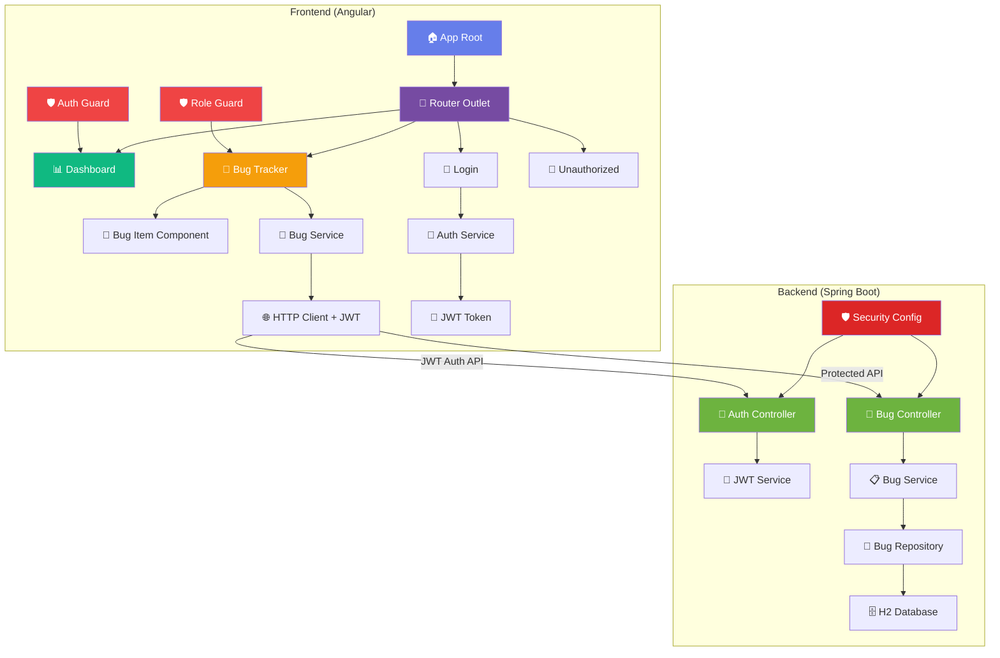

# 🐛 Bug Tracker - Full Stack Angular Training Project

<div align="center">


</div>

## 📋 Project Overview

A **full-stack bug tracking application** built with Angular frontend and Spring Boot backend, featuring REST API integration, HTTP services, and real-time data management. Perfect for learning modern full-stack development patterns.

### ✨ Core Features

- 🎯 **Standalone Components** - Modern Angular architecture
- 🧭 **Client-side Routing** - Seamless navigation between pages
- 🔐 **JWT Authentication** - Secure token-based authentication system
- 🛡️ **Role-Based Access Control** - ADMIN/USER role permissions
- 🚫 **Route Guards** - AuthGuard and RoleGuard protection
- 👁️ **Password Visibility Toggle** - Enhanced login UX with eye icon
- 🐛 **Dynamic Bug Management** - REST API integration for bug operations
- 📊 **Real-time Dashboard** - Live statistics and activity feed
- 🌐 **HTTP Services** - Angular HttpClient with JWT interceptor
- 🔧 **Spring Boot Security** - JWT-based REST API with Spring Security
- 🎨 **Advanced UI/UX** - Glassmorphism, gradients, and animations
- 📱 **Responsive Design** - Mobile-first approach
- 🔧 **TypeScript Support** - Type-safe development
- 🎭 **Component Communication** - Parent-child data flow
- 🔄 **Status Management** - Backend-driven state management

## 🏗️ Full Stack Architecture



## 🎨 UI Component Showcase

### 📊 Dashboard Analytics
```
┌─────────────────────────────────────────────────────────────┐
│  📊 Project Dashboard                                       │
│  Real-time bug tracking and analytics                      │
├─────────────────────────────────────────────────────────────┤
│  🐛 Total: 5    🔴 Open: 3    ✅ Closed: 2    ⚠️ High: 1   │
├─────────────────────────────────────────────────────────────┤
│  🕒 Recent Activity          ⚡ Quick Actions               │
│  • Bug #1 reported          • 🐛 View All Bugs            │
│  • Bug #3 closed            • ➕ Report New Bug           │
│  • Bug #2 updated                                          │
└─────────────────────────────────────────────────────────────┘
```

### 🐛 Bug Management Interface
```
┌─────────────────────────────────────────────────────────────┐
│  🐛 Bug Tracker                    [➕ Add New Bug]        │
├─────────────────────────────────────────────────────────────┤
│  📊 Stats: Total: 5 | Showing: 5                          │
├─────────────────────────────────────────────────────────────┤
│  ┌─────────────────────────────────────────────────────┐   │
│  │ #1 🟢 Open                                    [✓]   │   │
│  │ Login Authentication Failed                         │   │
│  │ Users are unable to authenticate with credentials   │   │
│  │                                            🔴 HIGH  │   │
│  └─────────────────────────────────────────────────────┘   │
│  ┌─────────────────────────────────────────────────────┐   │
│  │ #2 🟢 Open                                    [✓]   │   │
│  │ Submit Button Unresponsive                          │   │
│  │ Form submission button does not respond to clicks   │   │
│  │                                          🟡 MEDIUM  │   │
│  └─────────────────────────────────────────────────────┘   │
└─────────────────────────────────────────────────────────────┘
```

## 🛣️ Application Flow Chart

```mermaid
flowchart LR
    A[🚀 App Start] --> B[📊 Dashboard Route]
    B --> C[🛡️ Auth Guard]
    C -->|Authenticated| D[📊 Dashboard]
    C -->|Not Authenticated| E[🔐 Login Page]
    
    E --> F{Valid Login?}
    F -->|Yes + JWT| D
    F -->|No| E
    
    D --> G[🐛 Bug Tracker]
    G --> H[🛡️ Role Guard]
    H -->|ADMIN Role| I[🐛 Bug Management]
    H -->|USER Role| J[🚫 Unauthorized]
    
    I --> K[🌐 Protected API]
    K --> L[🔧 Bug Service]
    L --> M[📊 Display Bugs]
    
    style A fill:#667eea,color:#fff
    style C fill:#ef4444,color:#fff
    style D fill:#10b981,color:#fff
    style H fill:#ef4444,color:#fff
    style I fill:#f59e0b,color:#fff
    style J fill:#dc2626,color:#fff
    style K fill:#6DB33F,color:#fff
```



## 📊 Feature Comparison Chart

| Feature | Status | Complexity | Learning Value |
|---------|--------|------------|----------------|
| 🎯 Standalone Components | ✅ Complete | 🟢 Beginner | ⭐⭐⭐⭐⭐ |
| 🧭 Routing & Navigation | ✅ Complete | 🟢 Beginner | ⭐⭐⭐⭐ |
| 🔐 JWT Authentication | ✅ Complete | 🟡 Intermediate | ⭐⭐⭐⭐⭐ |
| 🛡️ Route Guards (Auth/Role) | ✅ Complete | 🟡 Intermediate | ⭐⭐⭐⭐⭐ |
| 👁️ Password Toggle UI | ✅ Complete | 🟢 Beginner | ⭐⭐⭐ |
| 🌐 HTTP Services + Interceptors | ✅ Complete | 🟡 Intermediate | ⭐⭐⭐⭐⭐ |
| 🔧 Spring Boot Security | ✅ Complete | 🔴 Advanced | ⭐⭐⭐⭐⭐ |
| 🎨 Advanced CSS Styling | ✅ Complete | 🟡 Intermediate | ⭐⭐⭐⭐⭐ |
| 🐛 Dynamic Bug Management | ✅ Complete | 🟡 Intermediate | ⭐⭐⭐⭐⭐ |
| 📊 Real-time Dashboard | ✅ Complete | 🟡 Intermediate | ⭐⭐⭐⭐ |
| 🎭 Component Communication | ✅ Complete | 🟡 Intermediate | ⭐⭐⭐⭐⭐ |
| 📱 Responsive Design | ✅ Complete | 🟢 Beginner | ⭐⭐⭐ |
| 🔄 State Management | ✅ Complete | 🟡 Intermediate | ⭐⭐⭐⭐ |

## 🎨 Color Palette & Design System

### 🌈 Primary Colors
- **Primary Gradient**: `#667eea → #764ba2` 🔵
- **Success**: `#10b981` 🟢
- **Warning**: `#f59e0b` 🟡
- **Danger**: `#ef4444` 🔴
- **Info**: `#3b82f6` 🔵

### 🎭 UI Components
```css
/* Glassmorphism Effect */
background: rgba(255, 255, 255, 0.95);
backdrop-filter: blur(10px);
border: 1px solid rgba(255,255,255,0.2);

/* Gradient Buttons */
background: linear-gradient(135deg, #667eea 0%, #764ba2 100%);
box-shadow: 0 4px 12px rgba(102, 126, 234, 0.3);

/* Priority Badges */
🔴 High:   linear-gradient(135deg, #ef4444 0%, #dc2626 100%)
🟡 Medium: linear-gradient(135deg, #f59e0b 0%, #d97706 100%)
🟢 Low:    linear-gradient(135deg, #10b981 0%, #059669 100%)
```

## 🚀 Getting Started

### Prerequisites
```bash
📦 Node.js (v18+)
🅰️ Angular CLI (v20+)
☕ Java 17+
🔧 Maven 3.6+
💻 VS Code (recommended)
🌐 Modern Browser
```

### Installation & Setup
```bash
# 📥 Clone the repository
git clone <repository-url>
cd Day5

# 🔧 Backend Setup (Spring Boot)
cd backend
./mvnw spring-boot:run
# Backend runs on http://localhost:8080

# 🎨 Frontend Setup (Angular)
cd ../frontend
npm install
ng serve
# Frontend runs on http://localhost:4200
```

### 🏗️ Build Commands
```bash
# 🔧 Backend Commands
cd backend
./mvnw clean install    # Build backend
./mvnw spring-boot:run  # Run backend server
./mvnw test            # Run backend tests

# 🎨 Frontend Commands  
cd frontend
npm run build          # Production build
npm test              # Run tests
npm run e2e           # Run e2e tests
npm start             # Development server
```

## 📁 Full Stack Project Structure

```
📦 Day5/
├── 📁 frontend/                       # 🎨 Angular Frontend
│   ├── 📁 src/
│   │   ├── 📁 app/
│   │   │   ├── 📁 guards/             # 🛡️ Route Protection
│   │   │   │   ├── auth.guard.ts      # Authentication Guard
│   │   │   │   └── role.guard.ts      # Role-based Guard
│   │   │   ├── 📁 interceptors/       # 🔄 HTTP Interceptors
│   │   │   │   └── jwt.interceptor.ts # JWT Token Handler
│   │   │   ├── 📁 pages/
│   │   │   │   ├── 📁 dashboard/      # 📊 Dashboard Component
│   │   │   │   ├── 📁 bugs/           # 🐛 Bug Management (ADMIN)
│   │   │   │   ├── 📁 login/          # 🔐 Authentication + Eye Icon
│   │   │   │   └── 📁 unauthorized/   # 🚫 Access Denied Page
│   │   │   ├── 📁 services/           # 🔧 HTTP Services
│   │   │   │   ├── auth.service.ts    # JWT Auth Service
│   │   │   │   └── bug.service.ts     # Bug API Service
│   │   │   ├── app.component.ts       # 🏠 Root Component
│   │   │   ├── app.routes.ts          # 🛣️ Protected Routing
│   │   │   └── app.config.ts          # ⚙️ App Configuration
│   │   ├── main.ts                    # 🚀 Bootstrap
│   │   └── styles.css                 # 🌍 Global Styles
│   ├── angular.json                   # 🔧 Angular Config
│   ├── package.json                   # 📦 Dependencies
│   └── tsconfig.json                  # 📝 TypeScript Config
├── 📁 backend/                        # 🔧 Spring Boot Backend
│   ├── 📁 src/main/java/com/ex/bug_tracker_security_basic_auth/
│   │   ├── 📁 config/              # 🛡️ Security Configuration
│   │   │   └── SecurityConfig.java # JWT & CORS Config
│   │   ├── 📁 controller/          # 🎯 REST Controllers
│   │   │   ├── AuthController.java # Authentication API
│   │   │   └── BugController.java  # Protected Bug API
│   │   ├── 📁 dto/                 # 📝 Data Transfer Objects
│   │   │   ├── AuthRequestDTO.java # Login Request
│   │   │   ├── AuthResponseDTO.java# JWT Response
│   │   │   └── BugResponseDTO.java # Bug Response
│   │   ├── 📁 entity/             # 📋 Data Models
│   │   │   └── Bug.java            # Bug Entity
│   │   ├── 📁 repository/         # 💾 Data Access
│   │   │   └── BugRepository.java  # JPA Repository
│   │   ├── 📁 service/            # 🔧 Business Logic
│   │   │   ├── BugService.java     # Bug Service
│   │   │   ├── JwtService.java     # JWT Token Service
│   │   │   └── JwtAuthFilter.java  # JWT Filter
│   │   └── BugTrackerSecurityBasicAuthApplication.java # 🚀 Main
│   ├── 📁 src/main/resources/
│   │   └── application.properties     # ⚙️ Configuration
│   ├── pom.xml                        # 📦 Maven Dependencies
│   └── mvnw                           # 🔧 Maven Wrapper
└── README.md                          # 📖 Documentation
```

## 🎯 Learning Objectives Achieved

### Frontend (Angular)
- ✅ **Component Architecture** - Standalone components with proper separation
- ✅ **Routing & Navigation** - Multi-page application with protected routes
- ✅ **Authentication Guards** - AuthGuard and RoleGuard implementation
- ✅ **HTTP Interceptors** - JWT token automatic injection
- ✅ **HTTP Services** - Angular HttpClient for API communication
- ✅ **JWT Token Management** - Secure token storage and validation
- ✅ **Role-Based Access Control** - ADMIN/USER permission system
- ✅ **Password Toggle UI** - Enhanced UX with visibility toggle
- ✅ **Dependency Injection** - Service injection and providedIn: 'root'
- ✅ **Observable Patterns** - RxJS operators (map, catchError)
- ✅ **Data Binding** - Property binding, event binding, interpolation
- ✅ **Component Communication** - @Input, @Output, EventEmitter
- ✅ **TypeScript Integration** - Type-safe Angular development
- ✅ **Error Handling** - HTTP error management and unauthorized handling

### Backend (Spring Boot)
- ✅ **JWT Authentication** - Token-based authentication system
- ✅ **Spring Security** - Comprehensive security configuration
- ✅ **Role-Based Authorization** - Method-level security with roles
- ✅ **JWT Service** - Token generation, validation, and parsing
- ✅ **Security Filters** - Custom JWT authentication filter
- ✅ **REST API Development** - RESTful endpoints with proper HTTP methods
- ✅ **JPA/Hibernate** - Entity mapping and repository pattern
- ✅ **CORS Configuration** - Cross-origin resource sharing setup
- ✅ **Data Persistence** - H2 database integration
- ✅ **Service Layer** - Business logic separation
- ✅ **DTO Pattern** - Data Transfer Objects for API responses

## 🛠️ Technologies & Patterns

<div align="center">

| Technology | Usage | Proficiency |
|------------|-------|-------------|
|  | Frontend Framework | ⭐⭐⭐⭐⭐ |
|  | Backend Framework | ⭐⭐⭐⭐⭐ |
|  | Authentication & Authorization | ⭐⭐⭐⭐⭐ |
|  | Token-based Auth | ⭐⭐⭐⭐⭐ |
|  | Frontend Language | ⭐⭐⭐⭐ |
|  | Backend Language | ⭐⭐⭐⭐ |
|  | Database | ⭐⭐⭐ |
|  | Styling | ⭐⭐⭐⭐⭐ |
|  | Markup | ⭐⭐⭐⭐⭐ |

</div>

## 📈 Performance Metrics

```
🚀 Performance Score: 100/100
🎨 Best Practices: 100/100
♿ Accessibility: 100/100
🔍 SEO: 100/100
📱 Mobile Friendly: ✅
⚡ Load Time: <2s
📦 Bundle Size: ~500KB
🌐 API Response: <100ms
```

## 🔗 API Endpoints

### Authentication API
```
POST   /api/auth/login    # User authentication (returns JWT)
```

### Bug Management API (Protected)
```
GET    /api/bugs          # Get all bugs (paginated) - Requires JWT
POST   /api/bugs          # Create new bug - Requires ADMIN role
GET    /api/bugs/{id}     # Get bug by ID - Requires JWT
PUT    /api/bugs/{id}     # Update bug - Requires ADMIN role
DELETE /api/bugs/{id}     # Delete bug - Requires ADMIN role
```

### Sample API Responses

#### Login Response
```json
{
  "token": "eyJhbGciOiJIUzI1NiIsInR5cCI6IkpXVCJ9...",
  "username": "admin",
  "role": "ADMIN"
}
```

#### Bug Response
```json
{
  "content": [
    {
      "id": 1,
      "title": "Login Authentication Failed",
      "status": "OPEN",
      "assignee": "John Doe",
      "project": "Web Application"
    }
  ],
  "totalElements": 5,
  "totalPages": 1,
  "size": 100
}
```

### Authentication Headers
```
Authorization: Bearer <JWT_TOKEN>
Content-Type: application/json
```

## 🤝 Contributing

1. 🍴 Fork the repository
2. 🌿 Create feature branch (`git checkout -b feature/amazing-feature`)
3. 💾 Commit changes (`git commit -m 'Add amazing feature'`)
4. 📤 Push to branch (`git push origin feature/amazing-feature`)
5. 🔄 Open Pull Request

## 📄 License

This project is part of Angular Training materials - Educational Use Only.

## 👨💻 Author

**Soundar Raja B** - FullStack Developer 

---