# 🎮 TETRIS ULTRA - Modern Edition

<div align="center">


[](https://soundar-19.github.io/AngularTraining/Project2/Game/index.html)
[](https://www.typescriptlang.org/)
[](https://developer.mozilla.org/en-US/docs/Web/HTML)
[](https://developer.mozilla.org/en-US/docs/Web/CSS)

**🚀 Experience the classic Tetris game reimagined with ultra-modern UI, stunning visual effects, and professional-grade features!**

</div>

---

## 📸 Game Screenshots

<div align="center">

### 🎯 Main Game Interface
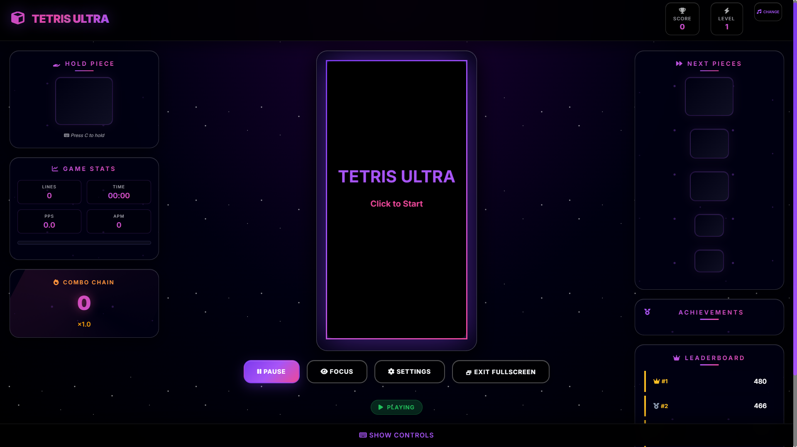

### GamePlay Interface
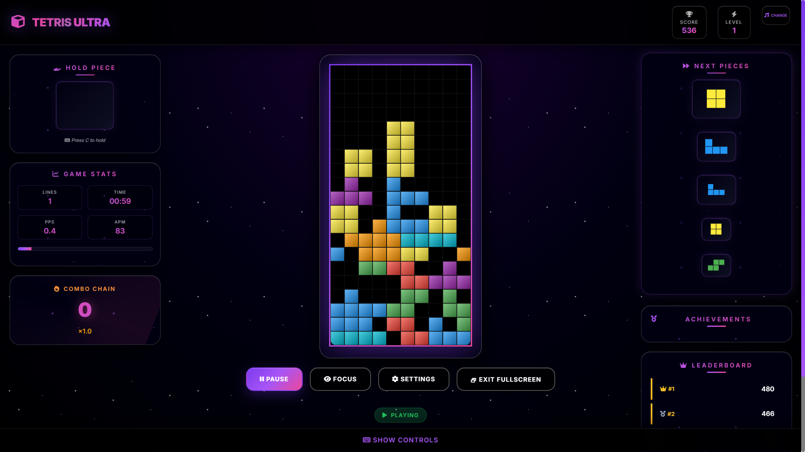

### Game Over Screen
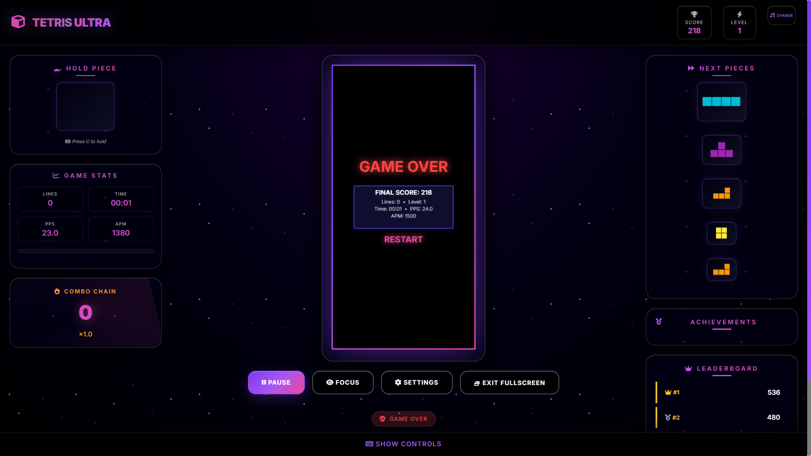

### Game Controls
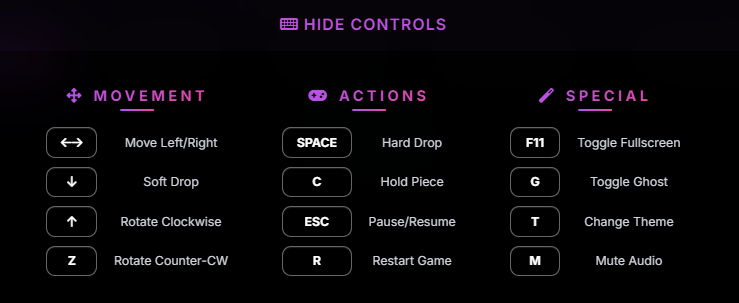

### 🏆 Achievement System
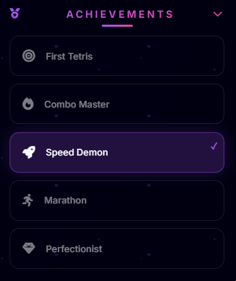

### ⚙️ Settings Panel
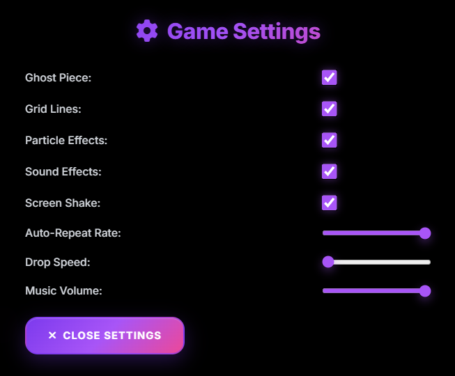

</div>

---

## ✨ Key Features

<div align="center">

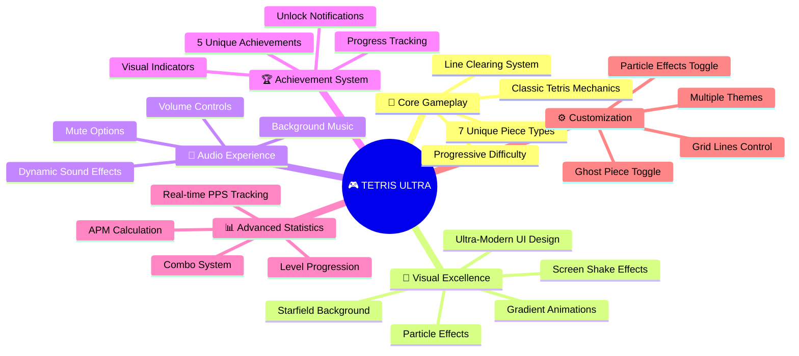

</div>

---

## 🎮 Game Flow Architecture

<div align="center">

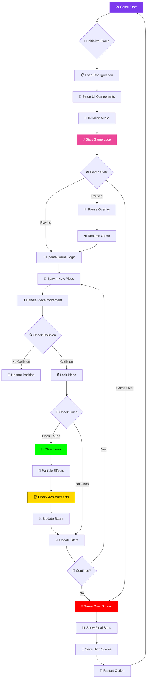

</div>

---

## 🎯 Core Game Mechanics

### 🧩 Tetris Pieces (Tetrominoes)

<div align="center">

| Piece | Shape | Color | Special Properties |
|-------|-------|-------|-------------------|
| **I** | `████` | 🟦 **Cyan** `#00ffff` | Line piece - Creates Tetris |
| **O** | `██`<br>`██` | 🟨 **Yellow** `#ffff00` | Square - No rotation |
| **T** | `▄█▄`<br>`███` | 🟪 **Magenta** `#ff00ff` | T-spin capable |
| **S** | `▄██`<br>`██▄` | 🟩 **Green** `#00ff00` | S-shaped |
| **Z** | `██▄`<br>`▄██` | 🟥 **Red** `#ff0044` | Z-shaped |
| **J** | `█▄▄`<br>`███` | 🔵 **Blue** `#0088ff` | J-shaped |
| **L** | `▄▄█`<br>`███` | 🟧 **Orange** `#ff8800` | L-shaped |

</div>

### 🎯 Scoring System

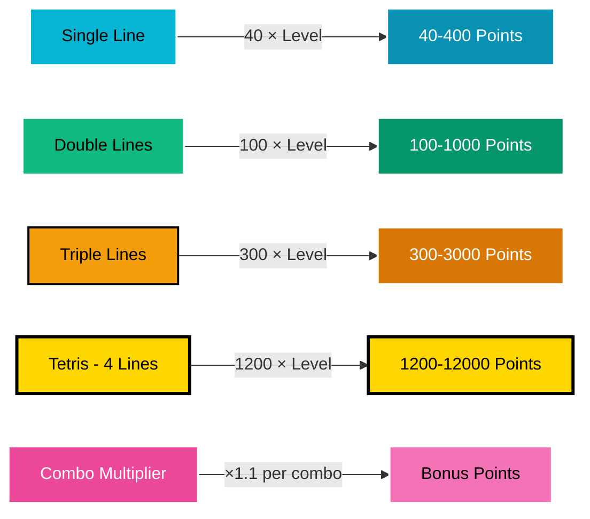

---

## 🎮 Controls & Gameplay

<div align="center">

### 🎯 Movement Controls
| Key | Action | Description |
|-----|--------|-------------|
| `←` `→` | **Move** | Move piece left/right |
| `↓` | **Soft Drop** | Accelerate piece downward |
| `↑` | **Rotate CW** | Rotate piece clockwise |
| `Z` | **Rotate CCW** | Rotate piece counter-clockwise |
| `Space` | **Hard Drop** | Instantly drop piece |

### 🎮 Game Controls
| Key | Action | Description |
|-----|--------|-------------|
| `C` | **Hold** | Hold current piece for later |
| `Esc` | **Pause** | Pause/Resume game |
| `R` | **Restart** | Restart current game |
| `F11` | **Fullscreen** | Toggle fullscreen mode |

### ⚙️ Special Features
| Key | Action | Description |
|-----|--------|-------------|
| `G` | **Ghost Toggle** | Show/hide ghost piece |
| `T` | **Theme Cycle** | Change color themes |
| `M` | **Mute** | Toggle audio on/off |

</div>

---

## 🏆 Achievement System

<div align="center">

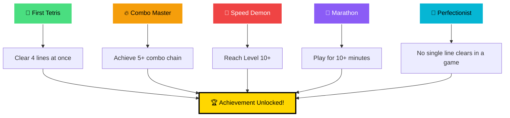

</div>

---

## 📊 Advanced Statistics

### 📈 Real-time Metrics

<div align="center">

| Metric | Description | Calculation |
|--------|-------------|-------------|
| **PPS** | Pieces Per Second | `Total Pieces ÷ Game Time` |
| **APM** | Actions Per Minute | `Total Actions ÷ (Game Time ÷ 60)` |
| **Combo** | Consecutive Line Clears | `Lines cleared without gaps` |
| **Level** | Current Difficulty | `Lines ÷ 10 + 1` |
| **Efficiency** | Lines per Piece | `Total Lines ÷ Total Pieces` |

</div>

### 🎯 Performance Tracking

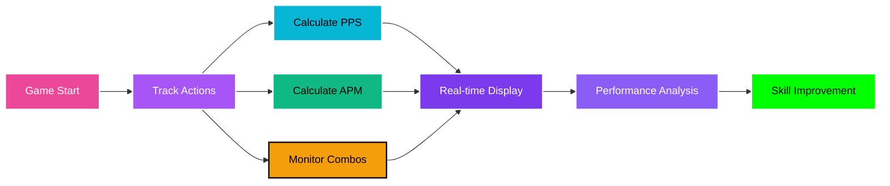

---

## 🎨 Visual Features

### ✨ Modern UI Elements

- **🌟 Gradient Animations** - Smooth color transitions
- **💫 Particle Effects** - Dynamic visual feedback
- **🌌 Starfield Background** - Animated cosmic atmosphere
- **📱 Responsive Design** - Works on all screen sizes
- **🎭 Multiple Themes** - Customizable color schemes
- **👻 Ghost Piece** - Preview piece placement
- **📊 Progress Bars** - Visual level progression
- **🔥 Screen Shake** - Impact feedback effects

### 🎨 Theme System

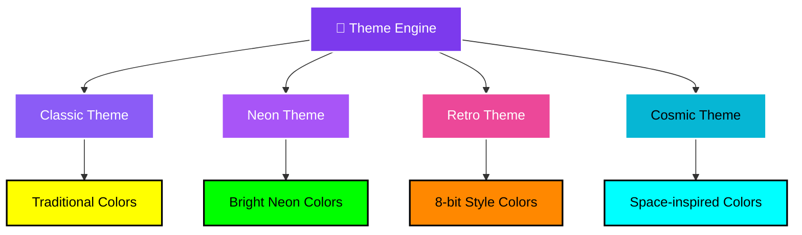

---

## ⚙️ Technical Architecture

### 🏗️ System Architecture

<div align="center">

```mermaid
graph TB
    A[🎮 Tetris Game Engine] --> B[🎯 Game Logic Layer]
    A --> C[🎨 Rendering Engine]
    A --> D[🎵 Audio Manager]
    A --> E[📊 Statistics Tracker]
    A --> F[💾 Data Persistence]
    
    B --> B1[Piece Movement]
    B --> B2[Collision Detection]
    B --> B3[Line Clearing]
    B --> B4[Level Progression]
    
    C --> C1[Canvas Rendering]
    C --> C2[UI Components]
    C --> C3[Particle System]
    C --> C4[Animation Engine]
    
    D --> D1[Sound Effects]
    D --> D2[Background Music]
    D --> D3[Volume Control]
    
    E --> E1[Score Calculation]
    E --> E2[Performance Metrics]
    E --> E3[Achievement Tracking]
    
    F --> F1[High Scores]
    F --> F2[Settings]
    F --> F3[Achievement Data]
    
    style A fill:#7c3aed,stroke:#ffffff,stroke-width:3px,color:#ffffff
    style B fill:#ec4899,stroke:#ffffff,stroke-width:2px,color:#ffffff
    style C fill:#06b6d4,stroke:#ffffff,stroke-width:2px,color:#000000
    style D fill:#10b981,stroke:#ffffff,stroke-width:2px,color:#000000
    style E fill:#f59e0b,stroke:#000000,stroke-width:2px,color:#000000
    style F fill:#8b5cf6,stroke:#ffffff,stroke-width:2px,color:#ffffff
```

</div>

### 📁 File Structure

```
📁 Tetris Ultra/
├── 📄 index.html          # Main HTML structure
├── 📄 app.ts             # Core game logic (TypeScript)
├── 📄 app.js             # Compiled JavaScript
├── 📄 styles.css         # Modern CSS styling
├── 📄 config.json        # Game configuration
└── 📄 README.md          # This documentation
```

### 🔧 Technologies Used

<div align="center">

| Technology | Purpose | Version |
|------------|---------|---------|
| **TypeScript** | Core game logic | Latest |
| **HTML5 Canvas** | Game rendering | Native |
| **CSS3** | Modern UI styling | Latest |
| **Web Audio API** | Sound effects | Native |
| **Local Storage** | Data persistence | Native |
| **Font Awesome** | Icon library | 6.4.0 |
| **Google Fonts** | Typography | Inter |

</div>

---

## 🚀 Getting Started

### 📋 Prerequisites

- Modern web browser (Chrome, Firefox, Safari, Edge)
- JavaScript enabled
- Audio support (optional)

### 🎮 Quick Start

1. **🌐 Online Play**: [Click here to play instantly](https://soundar-19.github.io/AngularTraining/Project2/Game/index.html)

2. **💻 Local Setup**:
   ```bash
   # Clone or download the repository
   git clone <repository-url>
   
   # Navigate to game directory
   cd Game
   
   # Open in browser
   open index.html
   ```

3. **🎯 Start Playing**:
   - Use arrow keys to move pieces
   - Press Space for hard drop
   - Press C to hold pieces
   - Press Esc to pause

---

## 🎯 Game Modes & Features

### 🎮 Core Gameplay Features

<div align="center">

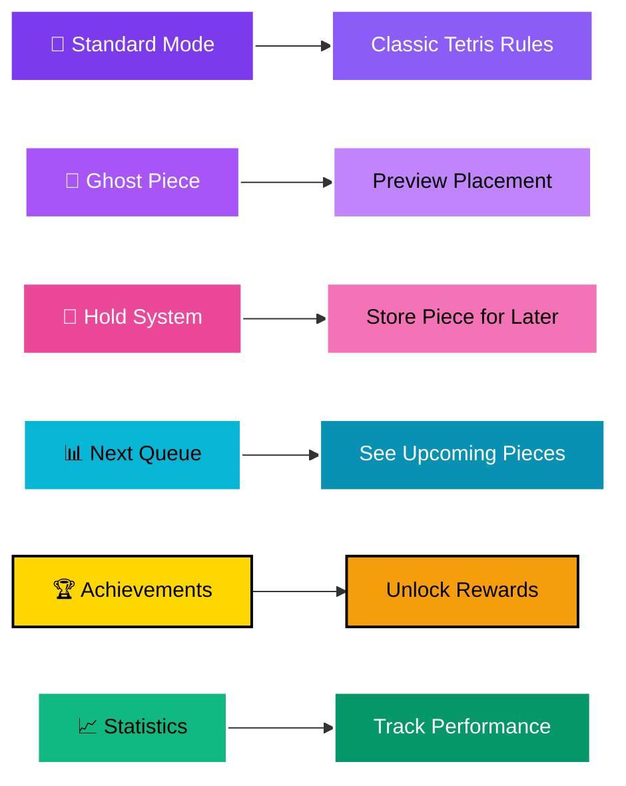

</div>

### ⚙️ Customization Options

- **🎨 Visual Settings**:
  - Ghost piece visibility
  - Grid lines toggle
  - Particle effects control
  - Screen shake intensity

- **🎵 Audio Settings**:
  - Sound effects volume
  - Background music control
  - Mute options

- **🎮 Gameplay Settings**:
  - Auto-repeat rate
  - Drop speed adjustment
  - Control sensitivity

---

## 📱 Responsive Design

### 📐 Screen Compatibility

<div align="center">

| Device Type | Screen Size | Layout |
|-------------|-------------|--------|
| **🖥️ Desktop** | 1200px+ | Full 3-column layout |
| **💻 Laptop** | 768px - 1199px | Responsive grid |
| **📱 Tablet** | 480px - 767px | Stacked layout |
| **📱 Mobile** | < 480px | Single column |

</div>

### 🎯 Adaptive Features

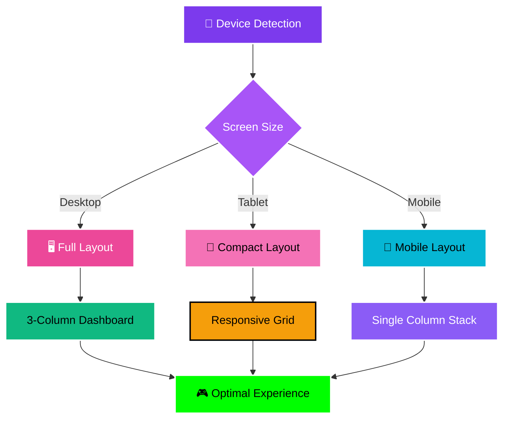

---

## 🏆 High Scores & Leaderboard

### 📊 Score Tracking System

- **🥇 Top 5 High Scores** - Local leaderboard
- **📈 Personal Best Tracking** - Individual records
- **🎯 Session Statistics** - Current game metrics
- **💾 Persistent Storage** - Scores saved locally

### 🎯 Scoring Breakdown

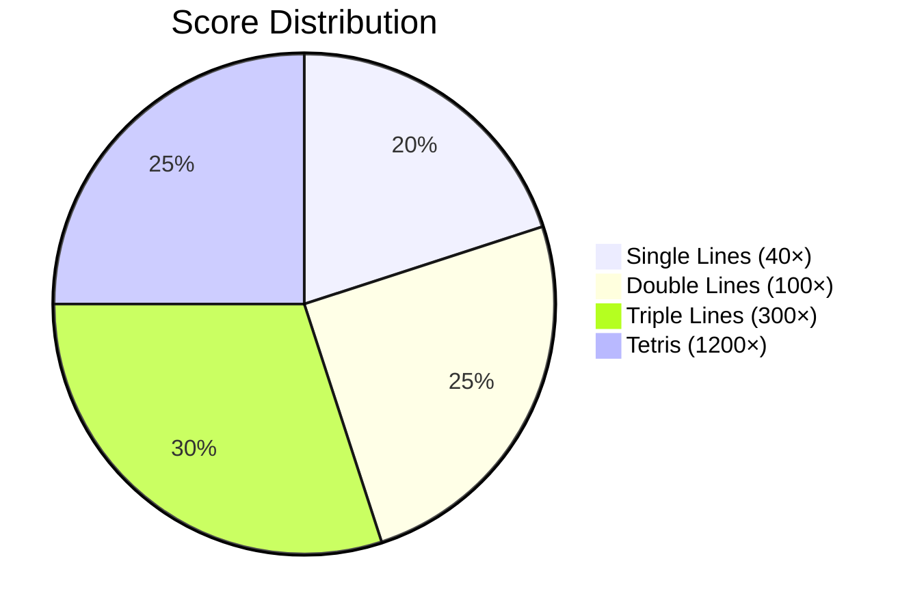

---

## 🎵 Audio Experience

### 🔊 Sound Design

<div align="center">

| Sound Effect | Trigger | Purpose |
|--------------|---------|---------|
| **🎵 Background Music** | Game start | Ambient atmosphere |
| **💥 Line Clear** | Lines cleared | Success feedback |
| **🔒 Piece Lock** | Piece placement | Action confirmation |
| **🎯 Level Up** | Level increase | Achievement sound |
| **🏆 Achievement** | Unlock earned | Reward notification |

</div>

### 🎛️ Audio Controls

- **🔊 Master Volume** - Overall audio level
- **🎵 Music Toggle** - Background music on/off
- **🔇 Mute All** - Quick silence option
- **⚙️ Individual Controls** - Per-effect volume

---

## 🛠️ Development & Customization

### 🔧 Configuration Options

The game uses `config.json` for easy customization:

```json
{
  "gameSettings": {
    "boardWidth": 10,
    "boardHeight": 20,
    "blockSize": 40,
    "dropSpeed": 500,
    "speedIncrease": 50,
    "linesPerLevel": 10
  },
  "colors": {
    "I": "#00ffff",
    "O": "#ffff00",
    "T": "#ff00ff"
  }
}
```

### 🎨 Theme Customization

Create custom themes by modifying the color schemes in the TypeScript code:

```typescript
themes = [
  { /* Classic Theme */ },
  { /* Neon Theme */ },
  { /* Custom Theme */ }
];
```

---

## 🐛 Troubleshooting

### ❓ Common Issues

<div align="center">

| Issue | Solution |
|-------|----------|
| **🎮 Game not loading** | Check JavaScript is enabled |
| **🔇 No sound** | Verify audio permissions |
| **📱 Mobile controls** | Use touch-friendly interface |
| **💾 Scores not saving** | Check local storage permissions |

</div>

### 🔧 Performance Tips

- **🖥️ Use modern browser** for best performance
- **🔊 Disable audio** if experiencing lag
- **📱 Close other tabs** on mobile devices
- **⚡ Enable hardware acceleration** in browser

---

## 👨‍💻 Author

<div align="center">

**Soundar Raja B**

*Game Developer & Software Engineer*

</div>

---

<div align="center">

## 🎮 Ready to Play?

[](https://soundar-19.github.io/AngularTraining/Project2/Game/index.html)

**Experience the ultimate Tetris game with modern features and stunning visuals!**

---

*Made By Soundar Raja B*

</div>