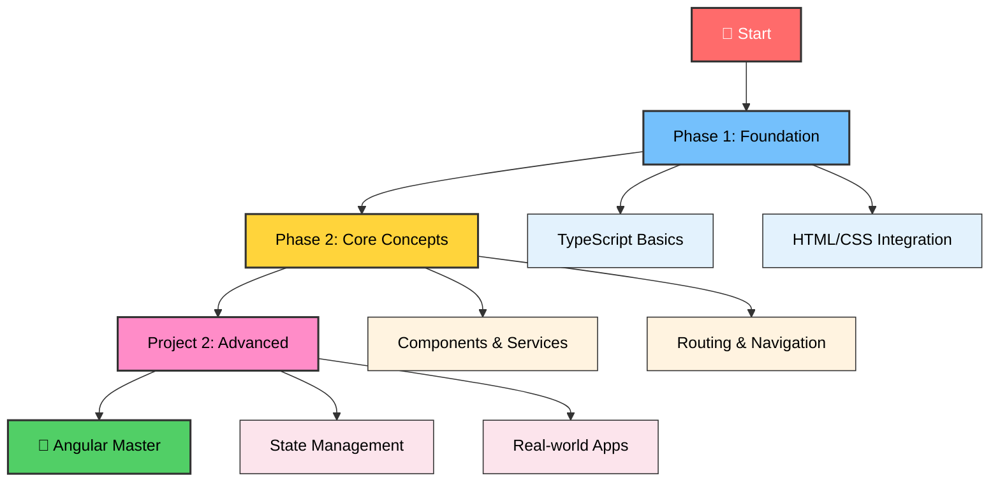

# 🅰️ Angular Learning Journey

<div align="center">


[]()
[]()
[]()

### *Master Angular One Concept at a Time* 🎯

</div>

## Live Projects
[Click Me!](https://soundar-19.github.io/AngularTraining/)

## 🌟 Learning Philosophy

<table>
<tr>
<td>

🔥 **Daily Commitment**
- One new concept daily
- Hands-on implementation
- Real-world projects
- Progressive difficulty

</td>
<td>

⚡ **Practical Approach**
- Build while learning
- Document everything
- Test implementations
- Share knowledge

</td>
</tr>
<tr>
<td>

🎨 **Modern Development**
- Latest Angular features
- TypeScript best practices
- Responsive design
- Clean architecture

</td>
<td>

🚀 **Career Growth**
- Industry standards
- Portfolio building
- Skill enhancement
- Continuous learning

</td>
</tr>
</table>

## 📊 Learning Roadmap

<div align="center">



</div>

## 🗂️ Repository Structure

<div align="center">

### 📁 Project Organization

</div>

```
🅰️ Angular Training/
├── 📚 Phase1/           # Foundation & TypeScript
├── ⚡ Phase2/           # Core Angular Concepts  
├── 🚀 Project2/         # Advanced Applications
└── 📖 README.md         # This documentation
```

## 🛠️ Tech Stack

<div align="center">


</div>

## 🎯 Learning Phases

### 🌱 Phase 1: Foundation
<div align="center">


</div>

- TypeScript fundamentals and implementation
- Core programming concepts
- Type safety and interfaces
- Basic DOM manipulation

### ⚡ Phase 2: Core Concepts
<div align="center">


</div>

- Angular fundamentals and concepts
- Component architecture
- Event handling
- Modern UI/UX design

### 🚀 Project 2: Advanced
<div align="center">


</div>

- Complex Angular applications
- State management
- API integration
- Production deployment

## 🚀 Quick Start Guide

### 1️⃣ Clone Repository
```bash
git clone <your-repository-url>
cd "Angular Training"
```

### 2️⃣ Explore Projects
```bash
# Navigate to any phase
cd Phase1/Ts-Calculator
cd Phase2/Calculator
```

### 3️⃣ Follow Project READMEs
```bash
# Each project has detailed setup instructions
cat README.md
```

## 📈 Learning Metrics

<div align="center">

| Metric | Value | Status |
|--------|-------|--------|
| **Days Active** | 🔥 Ongoing |  |
| **Concepts Learned** | 📚 Growing |  |
| **Projects Built** | 🚀 Multiple |  |
| **Skills Level** | 📊 Intermediate |  |

</div>

## 🎓 Learning Goals

<div align="center">

### 🎯 Objectives

</div>

- ✅ **Master Angular Fundamentals**
- ✅ **Build Production-Ready Apps**
- ✅ **Implement Best Practices**
- ✅ **Create Responsive Designs**
- ✅ **Understand TypeScript Integration**
- ✅ **Deploy Real-World Projects**

## 📝 Daily Learning Structure

<div align="center">

### 📋 Each Project Contains

</div>

| Component | Description |
|-----------|-------------|
| 📄 **Source Code** | Complete implementation |
| 📖 **README** | Concept explanations |
| ⚙️ **Config Files** | Setup and build configs |
| 🎨 **Styling** | CSS and design assets |
| 🧪 **Examples** | Usage demonstrations |

---
